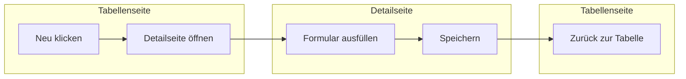

export const metadata = {
  title: 'Demo Use Case',
  theme: {
    layout: 'full',
    navbar: false,
    sidebar: false,
    toc: false,
    breadcrumb: false,
    pagination: false,
    typesetting: 'article'
  }
}

import { Steps } from 'nextra/components'
import { Tabs } from 'nextra/components'

# Create / Initial Page

## Create an initial Business Object

Nextra works like a Next.js plugin, and it accepts a theme config (layout) to
render the page. To start: [^3]

<Steps>
### Create Business Object

<Tabs items={['Preview', 'Description', 'Links']}>
  <Tabs.Tab>
    <QuadrelLightbox
      src="/assets/test/Shell.png"
      alt="Demo image"
      title="Demo-Bild"
      description="Kurzer erklärender Text zur Abbildung."
      thumbWidth={800}
      thumbStyle={{ marginTop: 8 }}
      lightboxPaddingY={72}
    />
  </Tabs.Tab>
  <Tabs.Tab>Some description</Tabs.Tab>
  <Tabs.Tab>wefgqewfqweq ew qew rqew</Tabs.Tab>
</Tabs>

### Install the docs theme

<Tabs items={['Preview', 'Description', 'Links']}>
  <Tabs.Tab>
    <QuadrelLightbox
      src="/assets/test/Shell.png"
      alt="Demo image"
      title="Demo-Bild"
      description="Kurzer erklärender Text zur Abbildung."
      thumbWidth={800}
      thumbStyle={{ marginTop: 8 }}
      lightboxPaddingY={72}
    />
  </Tabs.Tab>
  <Tabs.Tab>Some description</Tabs.Tab>
  <Tabs.Tab>wefgqewfqweq ew qew rqew</Tabs.Tab>
</Tabs>

</Steps>

